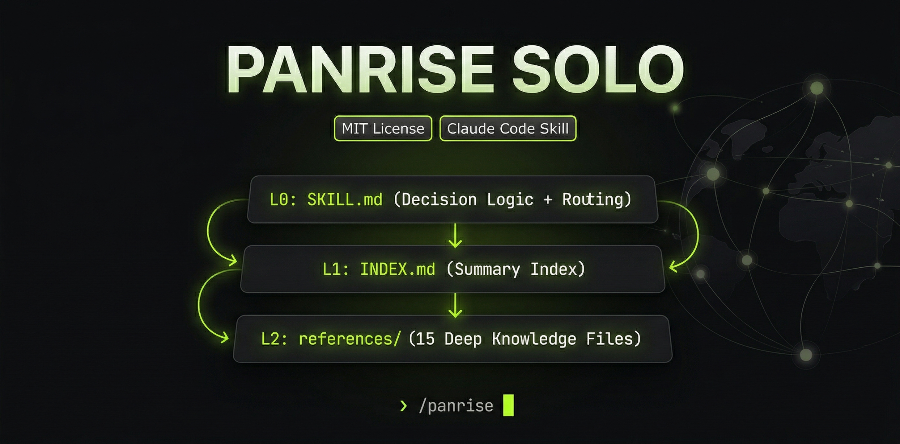

<div align="center">



# Panrise Solo

**AI advisor for one-person companies going global** | 一人公司全球化合规顾问

</div>

A Claude Code skill that turns Claude into an expert advisor for solo founders, freelancers, and digital nomads navigating international company formation, tax optimization, cross-border payments, and regulatory compliance.

## What It Does

Ask Claude about incorporating a company, and Panrise Solo activates automatically — providing jurisdiction-specific advice with real numbers (costs, tax rates, timelines) instead of generic answers.

**Covers 13 knowledge domains:**

| Domain | What You Get |
|--------|-------------|
| Jurisdiction Selection | Decision tree for 8+ jurisdictions (US LLC, HK Ltd, SG, Estonia, UK, Dubai, etc.) |
| Tax Optimization | Legal strategies, Flag Theory, deductions, income deferral |
| Tax Residency | 183-day rule, digital nomad visas, territorial tax countries |
| Forex Controls | Country-by-country limits (CN $50K, IN $250K LRS, TW, KR, BR) |
| Payments & Banking | Stripe / Mercury / Wise / Airwallex stack recommendations |
| VAT/GST | EU OSS, Merchant of Record strategy, country thresholds |
| Hiring Contractors | Contractor vs employee, EOR services, IP assignment |
| Data Compliance | GDPR, CCPA, cookie consent, privacy tools |
| IP & Trademark | Madrid Protocol, China first-to-file, domain strategy |
| Cost Comparison | Year 1 total cost for 8 jurisdictions |
| Tax Treaties | DTA routes, withholding tax rates |
| Industry Restrictions | China/Australia/Japan investment barriers |
| Company Structures | Single entity, dual entity, nomad patterns |

**Nationality-specific handling for:**
- 🇭🇰 Hong Kong founders (offshore profits exemption, FSIE regime, banking)
- 🇮🇳 Indian founders (FEMA/LRS, TCS, DTAA, Angel Tax)
- 🇺🇸 US citizens (worldwide taxation, CFC/GILTI traps, FEIE)
- 🇯🇵 Japanese founders (Foreign Exchange Act, worldwide income)
- 🇸🇬 Singapore founders (startup exemption, 0% capital gains, 80+ DTAs)
- 🇧🇷 Brazilian founders (Central Bank forex complexity)

## Install

### Claude Code CLI

```bash
claude mcp add-skill https://github.com/ar-gen-tin/panrise
```

Or manually copy to your skills directory:

```bash
git clone https://github.com/ar-gen-tin/panrise.git ~/.claude/skills/panrise
```

### Verify

```
/panrise
```

Or just ask Claude: "I'm a Chinese founder, where should I incorporate my SaaS company?"

## Usage Examples

```
"I'm a freelance designer in Berlin earning €80K/year from US clients. 
 Where should I register my company?"

"我是大陆开发者，做SaaS卖给全球客户，年收入$120K，应该在哪里注册公司？"

"インドのフリーランスエンジニアです。米国のクライアント向けにコンサルティングをしています。"

"I'm a US citizen living in Lisbon. How do I avoid CFC traps?"

"How do I pay contractors in the Philippines from my Wyoming LLC?"

"Do I need to register for EU VAT if I sell to French consumers?"
```

## Languages

The skill auto-detects and responds in: Chinese (中文), English, Japanese (日本語).

Knowledge base is in English. Responses adapt to the user's language.

## Structure

```
panrise/
├── SKILL.md                     # Main skill (decision logic + quick guides)
└── references/                  # Deep-dive knowledge base (13 files)
    ├── jurisdictions.md         # 8 jurisdictions with costs, tax rates
    ├── solo-structures.md       # Entity types + decision trees
    ├── forex-controls.md        # Country-by-country forex restrictions
    ├── tax-residency.md         # Digital nomad tax, 183-day rule
    ├── tax-optimization.md      # Legal tax strategies, Flag Theory
    ├── payments-banking.md      # Payment processors, banking
    ├── vat-gst.md               # VAT/GST compliance by country
    ├── cost-comparison.md       # Realistic Year 1 cost breakdowns
    ├── tax-treaties.md          # DTA routes, WHT rates
    ├── architecture-patterns.md # Company structure patterns
    ├── hiring-contractors.md    # Contractors, EOR, agreements
    ├── data-compliance.md       # GDPR, CCPA, privacy tools
    └── ip-trademark.md          # Trademark, copyright, domains
```

## Data Freshness

Tax rates, visa policies, and forex limits change. The knowledge base reflects **2024-2025 rules**. For amounts >$100K or life-changing decisions, verify current rules with a qualified tax advisor.

## Contributing

Found outdated info? Know a better jurisdiction strategy? PRs welcome.

Priority areas:
- More nationality-specific guides (Korean, Japanese, LatAm founders)
- Company exit/closure procedures
- Country-specific accounting tool recommendations

## License

MIT
